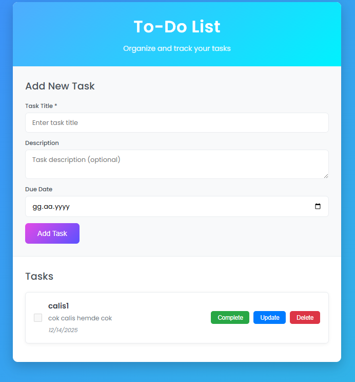

# ToDo List Uygulaması

Yapılacaklar listesi yönetimi. Arka uç ASP.NET Core Web API ile, ön uç ise HTML/CSS ve JavaScript kullanılarak yazılmıştır.

## Teknolojiler

**Backend:**
- ASP.NET Core Web API  
- Entity Framework Core  
- SQLite (SQL Server yerine tercih edilmiştir çünkü çalışırken sıkça bellek yetersizliğine neden olmuştur.)

**Frontend:**
- HTML / CSS  
- Vanilla JavaScript  

## Özellikler

- Görev ekleme, silme, güncelleme  
- Görev tamamlama ve geri alma  
- Son tarih belirleme

## Projeyi Çalıştırma

### 1. Backend

- Bu repoyu klonlayın.
- Bağımlılıkları yükleyin.
- API'yi çalıştırın.

### 2. Frontend

- `index.html` dosyasını Visual Studio Live Server eklentisi ile çalıştırabilirsiniz.
- Alternatif olarak dosyayı doğrudan bir tarayıcıda açabilirsiniz.

## Kullanım

### 1. Görev Oluşturma

- Başlık girin.  
- (İsteğe bağlı) Açıklama ve son tarih girin.  
- "Add Task" butonuna tıklayın.

**Görseller:**
- 
- 
- 

---

### 2. Görev Tamamlama

- Complete tuşuna basıldığında görev tamamlanır.
- Backend tarafında `isCompleted = true` olarak güncellenir.
- Undo butonu ile işlem geri alınabilir.

**Görsel:**
- 

---

### 3. Görev Silme

- Delete butonuna basıldığında sistem onay ister.
- Evet denirse görev kalıcı olarak silinir (geri alınamaz).

**Görseller:**
- 
- 

---

### 4. Görev Güncelleme

- Update butonuna basıldığında görev bilgileri forma yüklenir.
- Değişiklik yapılır ve "Update Task" butonuna tıklanarak görev güncellenir.

**Görseller:**
- 
- 
- 

---

## Testler

### API Testleri

- `POST /api/todoitems`  
  - Yeni görev başarıyla oluşturulur ve veritabanına kaydedilir.

- `PUT /api/todoitems/{id}`  
  - Başarı durumunda `204 NoContent` döner.  
  - Geçersiz ID durumunda `404 NotFound` döner.

### Kullanılan Test Araçları

- `xUnit` – Birim testleri için test framework’ü  
- `Microsoft.EntityFrameworkCore.InMemory` – Bellek içi veritabanı sağlayıcısı  
- `Microsoft.AspNetCore.Mvc` – Controller yanıt türleri  
- `Moq` – Projeye dahil edilmiştir fakat bu projede kullanılmamıştır

### Notlar

- Tüm testler bağımsız çalışır. Her testte ayrı bir in-memory veritabanı kullanılır.  
- Controller sınıfları doğrudan `DbContext` kullanır, bu nedenle Moq ile sahte nesne üretimine gerek kalmamıştır.
